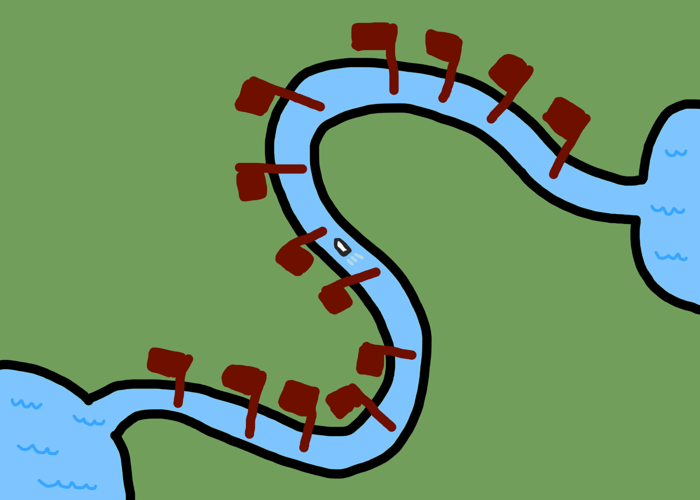

It seems like not a lot of open-source code is produced by solo developers anymore. It's now not uncommon to see a server written in Golang, running in Kubernetes, on AWS, serving an API that follows the GraphQL spec to an Android app written in TypeScript using React Native. It's wonderful that all this is provided entirely for free, but I want open-source development to be something I can do full time *on my own*, not under the direct employment of a bigcorp. Unfortunately, the economics here make it pretty much impossible for anyone to charge for open-source software. Even ideas like dual-licensing, which seem like they could work, were doomed from the start. Other strategies, like paid support or "open core", are usually [not sufficient in practice](https://stratechery.com/2019/aws-mongodb-and-the-economic-realities-of-open-source/). Many people hope that donations will be enough, but this seems unlikely to me. For a long time, the absolutely critical software [OpenSSL](https://arstechnica.com/information-technology/2014/04/tech-giants-chastened-by-heartbleed-finally-agree-to-fund-openssl/) was developed by basically one guy and only received $2,000 of donations a year. Among the [58 most popular projects on OpenCollective, more than 50% do not receive enough from donations to put their full-time contributors above the poverty line](https://staltz.com/software-below-the-poverty-line.html). 

Something must change. But to change the state of affairs, we must first understand how it came to be in the first place. A proper change is like a targeted strike that directly focuses on the root of the problem. Fortunately, I think I know what it is.

## Substitution drives costs down

It is an unintuitive fact that businesses sometimes *should* collude. Normally when businesses collude, they are doing it to raise prices and enrich themselves. Imagine one company making strawberries and one making blueberries. Normally if strawberries got more expensive, people would buy blueberries instead, so the strawberry producer would lose money. And the same applies to the blueberry producer. Neither has any incentive to raise their prices individually. But if the two work together, they could agree to raise their prices simultaneously to some calculated "optimal price" (from their perspective), leading to more profit for both of them. Although good for the businesses, this is bad for the consumer, so it tends to be illegal.  

Blueberries and strawberries are *[substitute goods](https://marketbusinessnews.com/financial-glossary/substitute-goods-definition-meaning/)* - buying one means you have less need for the other. Sometimes, companies have no motivation to collude to raise prices. Take butter and TVs, for instance. If one got more or less expensive it would have very little effect on the other. So generally, butter producers and TV manufacturers will not collude to [fix prices](https://en.wikipedia.org/wiki/Price_fixing), even if they were allowed to.

## Complements drive costs up

But there's a little-known third possibility. Imagine two lakes connected by a river, and boats want to travel down the river from one lake to the other. But 13 enterprising individuals have set up tolls along the path.

Imagine the average boat is willing to pay $120 to travel the river. If all the tolls charged $1000, no one would be interested and the toll owners would make very little money. But if they charged too little, like $1 per toll, they would be leaving money on the table because many boats would be willing to pay much more than that. For the sake of simplicity, let's say the optimal price was $10 per toll, which would be $130 to travel down the whole river.  

Now imagine you're a toll owner. You and all the other owners have calculated that you should each charge $10, because a price of $130 to travel down the whole river will lead to the most money being made. However, you might find yourself tempted to raise the price of your toll from $10 to $20. You'd get twice as much money from every passing boat, but the price of traveling the whole river would only go from $130 to $140, so not very many boats would be discouraged from crossing due to the price increase. But if everyone does this, the price of traveling the river will become cripplingly expensive, and every toll owner will suffer for it. It's a classic [prisoner's dilemma](https://plato.stanford.edu/entries/prisoner-dilemma/)! The only solution here is to coordinate on pricing - if you all got together, you could agree to each charge $10, and both toll and boat would benefit from it.

Notice that the situation with the toll owners is opposite to the fruit producers. That's because the tolls are a prototypical example of *[complementary goods](https://www.investopedia.com/terms/c/complement.asp)*. Buying one means you have more reason to buy the other. Just like substitute goods, complementary goods are very common. Examples include flashlights and batteries, cars and tires, computer parts and operating systems, etc. Complementary goods are *dual* to substitute goods. 

With substitute goods, it will be best for the producers if they all charge whatever the market will bear. But unless they coordinate, they will each have an incentive to lower their own prices, so they can steal the market from their competitor. With complementary goods, it would be best for the producers to charge what the market will bear. But they each have an incentive to *raise* their prices above even that. 

## This dynamic makes monopolies more likely

Imagine that what someone wants to do is create music. They could buy computer parts from AMD, a copy of windows from Microsoft, and a DAW (Digital Audio Workstation) from Ableton. For someone who wants to make music, these are complement goods. But each of these retailers is in the position of a toll booth owner in the previous example - that means prices will rise above where they "should" be and without coordination there's no way to lower them. This means they make less money *and* the consumers who are dedicated enough to buy anyway will have to pay more - a lose-lose. But for the retailers, it's even worse! If Apple sells a bundle of a computer, an OS, and a DAW, they can make it cheaper than what's available from the (disorganized) competition. 

And we see Apple does do this. They sell their in-house DAW, Logic, at a price much lower than any of their competition. Additionally, every Logic Pro X user has been getting free updates for the last 7 years. It makes sense when you think about it. If good, cheap software is only available to people who buy your hardware, *that means you can charge more for your hardware*. Ableton doesn't care about helping AMD make more money, so their pricing is going to be higher. 

## Vertical integration... everywhere

I like software, so that's what got me thinking about this. I used to think dual-licensing would be a good way for me to make a living making open-source software. For example, if I could make a good physics engine, I could dual-license it and sell it to big game studios. But they'd also probably want to buy a rendering engine from someone else, and a networking library from yet another person, etc. This would be incredibly vulnerable to a company like Epic, who can produce all this in-house (in the form of Unreal Engine), then sell licenses for a very attractive price. And indeed, this is exactly what we see. 

## The resolution

Fortunately, there is a way to fix this. Here's what someone has to do:

1) Create a new foundation. Let's call it the Sustainable Open-Source foundation for now (the SOS foundation).

2) Create a new license for libraries. Let's call it the SOS License. Anyone can use any SOS-licensed library for free in any product they make, as long as that product makes less than $1M/year in revenue. If a product makes more than that, 5% of the excess must be paid to the SOS foundation. Additionally, any improvements to the library shipped in any product must also be submitted as a pull-request to the original author. 

  1) Once you're paying the 5%, you can use an unlimited amount of SOS libraries in that project at no additional cost. 

  2) If you're a library author, you would be of course be free to dual-license your code under [AGPL](https://en.wikipedia.org/wiki/Affero_General_Public_License) and SOS. This should probably be the default actually (although I haven't thought that entirely through). 

3) The SOS foundation pays people who have licensed their libraries under the SOS license a "fair amount". Dhere is a lot of difficulty in calculating what exactly a fair amount is. You can't just use how popular a library is, because that ignores the difference in scope and effort to create something like OpenSSL and left-pad. You can't use popularity multiplied by lines of code, because that creates bad incentives to write more verbose code. I do have some ideas for how to do this, but they're outside the scope of this essay. Regardless it should be something transparent and predictable, and difficult to game.

  1) The foundation should probably also pay to sponsor "infant projects", which are competitors to closed-source software for which there exists no good open-source competition. 

  2) It could also sponsor things that are less common in open-source, like translating docs, writing tutorials, or increasing test coverage. 

  3) The money should go to all the contributors of the project, but probably the majority would go towards the main maintainers over people who just submit small typo-fix PRs and the like.

(This approach only works for software libraries. Something similar could maybe work for applications like Blender where small users play for free but big studios have to pay, I'm not sure.)

To start contributing, you'd just have to make a library and license it under SOS. Once it becomes popular and you deserve compensation, the SOS Foundation would get in touch with you and arrange payment. The most important and challenging part of all this would be earning the trust of the open-source community, so everyone can know they will be compensated fairly.

What would happen is that the open-source software industry collectively dual-licensing their entire output. Pay once, support the industry, and get access to all of it. The SOS license wouldn't be Open-Source as the [OSI](https://opensource.org/) defines it, but it would still be "pretty open". It also wouldn't be free software as defined by the [FSF](https://www.fsf.org/), but it would still be pretty free. It would be a sort of middle ground, the best of both worlds. 

I would like to make this happen. I'm willing to spend my own money to make it happen. I'm looking for ways to earn trust and establish a critical mass of developers using the SOS license. If any of this sounds interesting to you, get in touch with me at [andre@popovit.ch](mailto:andre@popovit.ch).