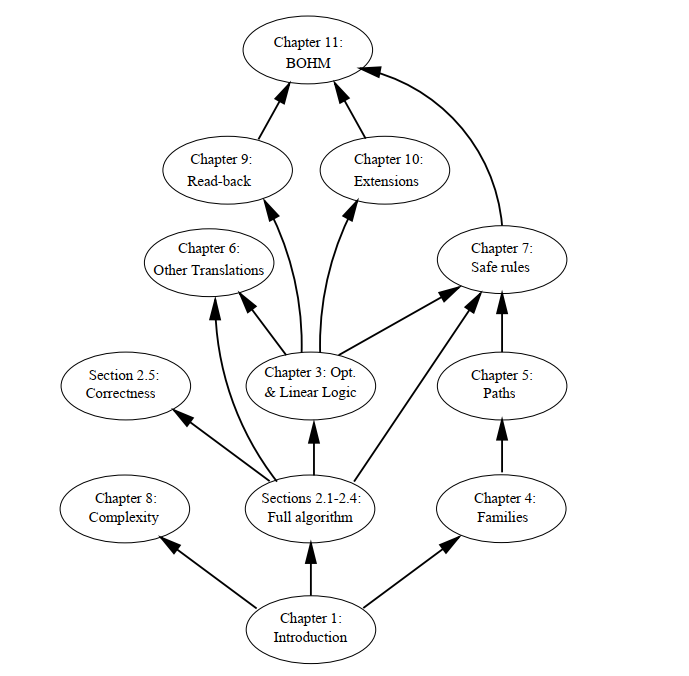

I just picked up [The Optimal Implementation of Functional Programming Languages](https://www.amazon.com/Implementation-Functional-Programming-Languages-Theoretical/dp/0521621127). Since I'm writing a functional programming language, currently nicknamed Zoda, this seemed like a natural buy. But this book is surprisingly difficult to read. For starters, here is the very beginning of the introduction:

> This book is about optimal sharing in functional programming languages.
> The formal notion of sharing we shall deal with was formalized in the
seventies by Levy in terms of "families" of redexes with a same origin -
more technically, in terms of sets of redexes that are residuals of a unique
(virtual) redex.

Not exactly light reading. Then, at the end of the chapter, you're greeted with this lovely flowchart: 

I can't think of a nerdier way to describe the recommended chapter reading order than with an inverted dependency graph. This book is a joy to read but a struggle to get through if you don't already know the author's terminology and notation. 